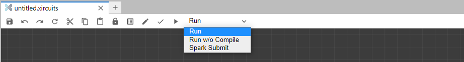
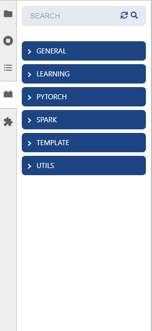

# Xircuits Interface

Xircuits is built on Jupyterlab, you will see a lot of familiar data scientist related tools. The following section introduces you to the Xircuits related interfaces. For the full Jupyterlab interface exploration, you may refer to the [Jupyterlab documentation](https://jupyterlab.readthedocs.io/en/stable/user/interface.html).

## Starting Xircuits

You can open the Xircuits canvas in two ways:
1. Opening an existing .xircuits file.
2. Creating a new Xircuits canvas via launcher.

  
Video

  

  </img>

  

Select the Xircuits tray widget on the left toolbar, you should then see the following screen.

## The Xircuits Canvas Interface
Once you open a .xircuits file or create a new one, you will see the Xircuits canvas.

### Xircuits Toolbar

The Xircuits toolbar is displayed on top of every Xircuits canvas. From left to right:

1. **Save**: Save current xircuits canvas.
2. **Undo**: Goes back one step.
3. **Redo**: Goes forward one step.
4. **Reload from Disk**: Reverts back to last saved point.
5. **Cut**: Cuts selected component(s) to clipboard.
6. **Copy**: Copies selected component(s) to clipboard.
7. **Paste**: Pastes component(s) from clipboard to canvas.
8. **Lock**: Locks all components in canvas. Locked components cannot be moved, linked-to nor deleted.
9. **Log**: Open xircuits log window.
10. **Test**: A button for Xircuits core feature testing purposes.
11. **Compile**: Codegens a python script based on current canvas. 
12. **Save and Run**: Executes the generated python script on the Python kernel based on Run Options.
13. **Xircuits Run Options**
    - **Run**: Saves, compiles, and executes Xircuits canvas.
    - **Run w/o Compile**: Saves current canvas but does not compile the python script. Executes python script with the same filename as the .xircuits file.
    - **Spark Submit**: Saves, compiles, then performs a cmd-based Spark Submit. For more information, read Spark Submit.
    
### Right Click Context Menu

You can open the context menu via right click.

1. **Cut**: Cuts selected component(s) to clipboard.
2. **Copy**: Copies selected component(s) to clipboard.
3. **Paste**: Pastes component(s) from clipboard to canvas.
4. **Reload Node**: Reloads selected component. Rerenders component based on current component python script, useful when adding / removing / modifying ports.
5. **Edit**: Modifies `Literal Components`. 
6. **Open Script**: Opens component's python script. 
7. **Delete**: Deletes component(s).
8. **Undo**: Goes back one step.
9. **Redo**: Goes forward one step.
10. **Add Comment**: Inserts a `Comment Component`.

### Component Related Interface

There are a few special interfaces for components. They are located at top right corner of components. 

1. Information Tooltip [ `⋮` ] : Displays the component information tooltip, if any. In the python component code, the comment is enclosed in the triple ''' ''' braces. 
2. Lock Component [ `🔒` ] : Locks selected component. Locked components cannot be moved, linked-to nor deleted.

In addition, for `Literal Components` you are able to modify the values by double clicking the component.

  
Video

  

  </img>

  

## The Component Library Tray

You can access the component library tray by selecting the block icon. 

1. **Search Bar**: Search your component.
2. **Refresh**: Refresh component list. Useful when adding new components and/or modifying existing ones.
3. **Xircuits Component List**
    - [General Components](../technical-concepts/xircuits-components/getting-started-with-xircuits-components.md#general-components) - general purpose components.
    - [Component Libraries](../technical-concepts/xircuits-components/getting-started-with-xircuits-components.md#xircuits-library-components) - Component libraries and components from the various component libraries.

Read More:
- [The Jupyterlab Interface](https://jupyterlab.readthedocs.io/en/stable/user/interface.html)
- [Xircuits Components](../technical-concepts/xircuits-components/getting-started-with-xircuits-components.md)