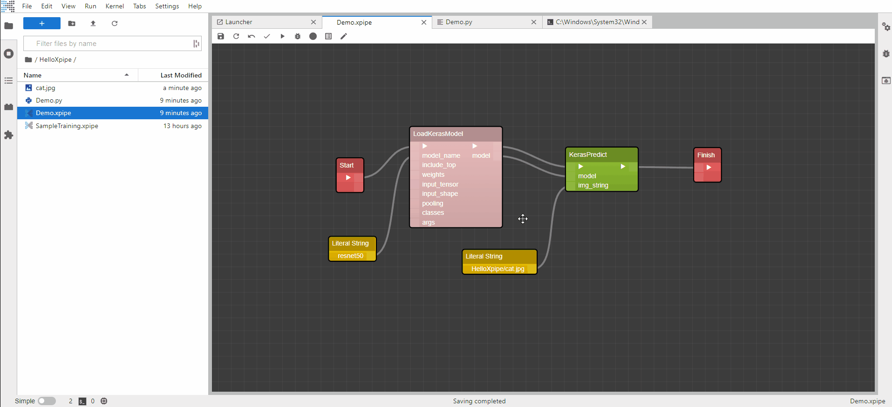

# Overview

Xpipes is a Jupyterlab-based extension that enables visual, low-code, training workflows. It allows anyone to easily create executable python code in seconds.

It is created by data scientists for data scientists. 

## Key Features

- **Visual Low Code Workflow**: Anyone can create complex workflows in seconds by simply dragging the components and connecting them.
- **Code Generation (CodeGen)**: Xpipes generates fully functional python code that can immediately be run in Xpipes or the terminal.
- **Customizable Components**: Xpipe components are very extendable and customizable. Create your own Xpipes component library and share it to the world!

## Workflow
1. Create a new Xpipes from the Jupyterlab launcher or open an existing .xpipe files.

2. Drag components from the Xpipes Component Tray to form your training workflow. Share data among your components using the in and out ports.

3. Press Compile button! The Xpipes will compile the components into a working python code.

4. Run the compiled python code using your own terminal or use our Output Viewer. 

5. Unexpected output? Would like to have more in-depth insights of the data between components? Mark the components you'd like to observe and try out our debugger.