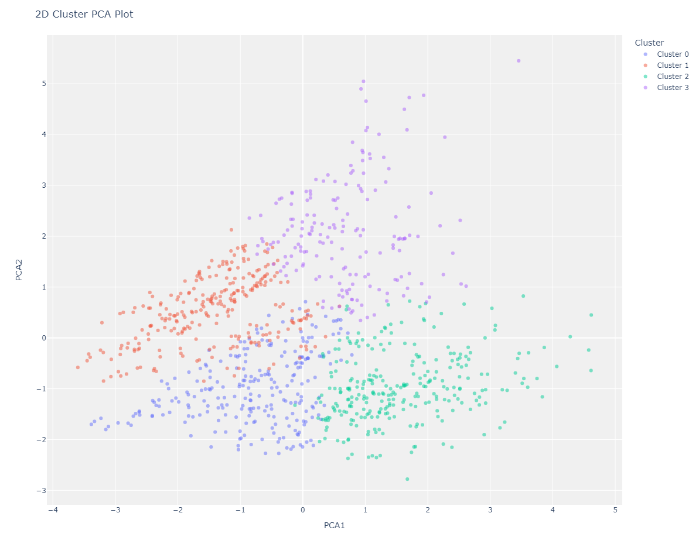

# Clustering

Before starting any of these examples, please ensure that you installed <code>Pycaret=>2.2</code> in your working environment. You can use <code>pip install pycaret==2.3.8</code> to install it too.
## Basic Pycaret AutoML Clustering

##### Example: AutoMLBasicClustering.xircuit

In this example, you will learn how to build a basic clustering Pycaret application that reads a tabular dataset, setup environment, create and assign clustering ML models, plot results and save the trained model.

1. To start the workflow,first you will need to get a dataset with  `GetData`. Here we chose the *mice* dataset. Additionally, `SampleTestData` could be used to set-aside a testing dataset.
   
2. To setup the Pycaret AutoML environment you will need the `SetupClustering`. This component initializes the training environment and creates the transformation pipeline. `SetupClustering` component must be present before executing any other component. It takes one mandatory parameter **in_dataset**. All the other parameters are optional.
   

3. `CreateModelClustering`: This component trains and evaluates the performance of a **selected model**. The output of this component is a trained clustering model.

4. `AssignModelClustering`: This function assigns cluster labels to the dataset for a given model, in this case we used the trained model from `CreateModelClustering` to add *cluster* column to the dataset.
   
5. `PlotModelAnomaly`: This component analyzes the performance of a trained model on the dataset. The type of the plot desired can be set in *plot_type*.

### Plot Graphs
#### Cluster PCA Plot (2d)

#### Elbow Plot

#### Silhouette Plot

#### Distribution Plot

6. Lastly, `SaveModelClustering`: This component saves the transformation pipeline and trained model object into the current working directory as a pickle file for later use.

