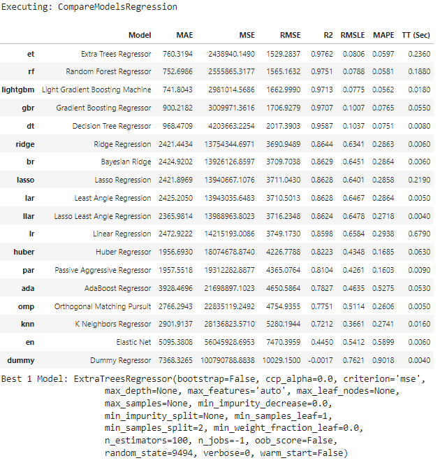
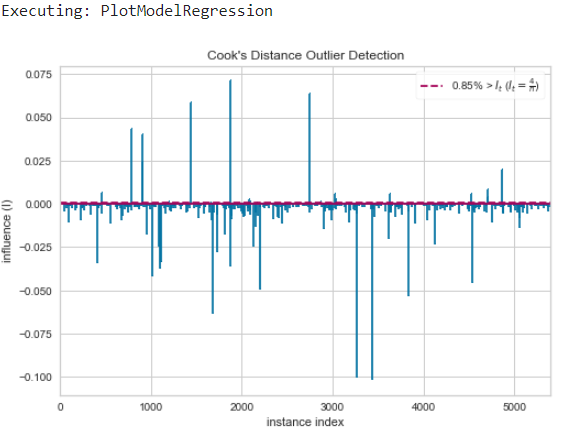

# Pycaret AutoML (Regression)

Before starting any of these examples, please ensure that you installed <code>Pycaret=>2.2</code> in your working environment. You can use <code>pip install pycaret==2.3.8</code> to install it too.    
## Basic Pycaret AutoML Regression

##### Example: AutoMLBasicRegression.xircuit

In this example, you will learn how to build a basic Pycaret application that reads a tabular dataset, setup environment, compare training on multiple ML models, fine-tune models, plot results and save the trained model.

1. To start the workflow,first you will need to get a dataset with  `GetData`. Here we chose the *diamonds* dataset. additionally, `SampleTestData` could be used to set-aside a testing dataset. 
   
2. To setup the Pycaret AutoML environment you will need the `SetupRegression`, This component initializes the training environment and creates the transformation pipeline. `SetupRegression` component must be present before executing any other component. It takes two mandatory parameters:in_dataset and target(label column). All the other parameters are optional.   
   
3. `CompareModelsRegression` This component trains and evaluates performance of all estimators available in the model library using cross validation.The output of this component is a score grid with average cross validated scores. additionally, it output a list of the top performing models, number of top model returned can be controlled by the *num_top* input. 
   
### Compare Model Output

4. `CreateModelRegression` This component trains and evaluates the performance of a **given model** using cross validation.The output of this component is a score grid with CV scores by fold and the created model. 

5. `TuneModelRegression` This component tunes the hyperparameter of a given model, in this case the output model from `CreateModelRegression`. The output of this component is a score grid with CV scores by fold of the best selected model based on optimize parameter and the tuned model. 
   
6. `PlotModelRegression` This component analyzes the performance of a trained model on holdout set. the type of the plot wanted could be set in *plot_type*

### Plot Residuals Graph

7. `PredictModelRegression` This component predicts Label (Regression value) using a trained model. When the *predict_dataset* input is None, it predicts label and score on the holdout(validation) set.
   
8. `FinalizeModelRegression` This component trains a given estimator on the entire dataset including the holdout set.
   
8.  `AutoMLRegression` This component returns the best model out of all trained models in current session based on the input *optimize* parameter(default optimize is Accuracy). 
    
10.  `SaveModelRegression` This component saves the transformation pipeline and trained model object into the current working directory as a pickle file for later use.

## Pycaret AutoML Model Operation 

##### Example: AutoMLRegressionStackModels.xircuits 

In this example, you will learn how to build to apply transformation on the dataset, stack the top performing model, plot, evaluate and save the model.

1. As with the previous example, you would start with a `GetData` and `SampleTestData`.

2. To perform transformation on the dataset you would require to pass parameters to the transformation inputs in `SetupRegression`. available dataset transform operation:
   1. *transform_target* : When set to True, target variable is transformed using the method defined in transform_target_method param. Target transformation is applied separately from feature transformations.
   2. *transform_target_method* : Box-cox' and 'yeo-johnson' methods are supported. Box-Cox requires input data to be strictly positive, while Yeo-Johnson supports both positive or negative data. 
   3. *normalize* : when set to True, it transforms the numeric features by scaling them to a given range. 
   4. *transformation* : when set to True, it applies the power transform to make data more Gaussian-like.   
   5. *ignore_low_variance* : When set to True, all categorical features with insignificant variances are removed from the data.
   6. *remove_multicollinearity* : When set to True, features with the inter-correlations higher than the defined threshold are removed.
   7. *multicollinearity_threshold* :Threshold for correlated features. Ignored when remove_multicollinearity is not True.
   8. *combine_rare_levels* : When set to True, frequency percentile for levels in categorical features below a certain threshold is combined into a single level.
   9. *rare_level_threshold* : Percentile distribution below which rare categories are combined. Ignored when combine_rare_levels is not True. 
   10. *bin_numeric_features* : To convert numeric features into categorical,It takes a list of strings with column names that are related.
   11. *group_features* : When the dataset contains features with related characteristics, group_features parameter can be used for feature extraction. It takes a list of strings with column names that are related.

    More data transformation techniques from Pycaret could be added to the `SetupRegression` component simply by adding new inputs to the component script. 

3. `StackModelsRegression` This component trains a meta model over select estimators passed in the estimator_list parameter. The output of this function is a score grid with CV scores by fold. Here, you could pass a list of top models from the `CompareModelsRegression` component or create multiple models and link them to the *model_1,model_2,model_3* inputs. 

4. `logging` this component save all the trained models logs to MLflow dashboard can access at localhost:5000, to activate logging you will need to set *log_experiment* in `SetupRegression` component to True.  

